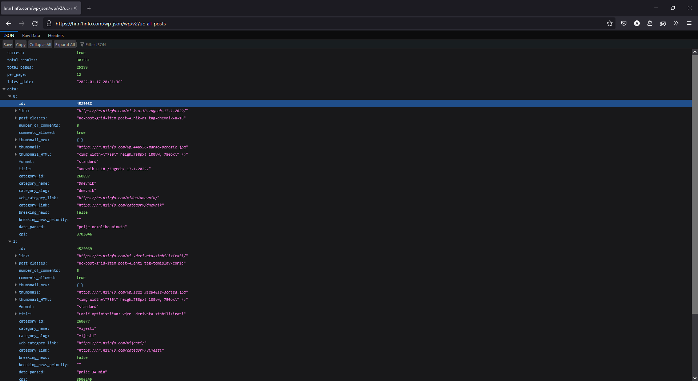
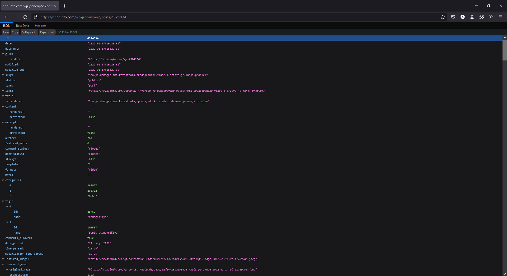

# Projektni zadatak - Upravljanje znanjem
Odjel za informatiku, Sveučilište u Rijeci  
Akademska godina 2021/2022

*Odabrani portal*: https://hr.n1info.com/  
*Autor*: Andrea Hrelja  
*Nositelji kolegija*:
- izv. prof. dr. sc. Ana Meštrović
- dr. sc. Slobodan Beliga

## Sažetak

Projektni zadatak stvoren je u sklopu kolegija Upravljanje znanjem, a sastoji se od nekoliko procesa koji se provode kroz program napisan u programskom jeziku Python:

1. Prikupljanje podataka s odabranog portala za vijesti
   - koriste se metode prikupljanja podataka s web sjedišta
2. Čišćenje i transformacija prikupljenih podataka
   - čiste se duplicirani i nepostojeći podaci
   - očišćeni se skup podataka transformira sa svrhom stvaranja novih korisnih informacija
3. Analiza podataka
   - analiziraju se trendovi o kojima odabrani portal izvještava

U nastavku je svaki proces detaljnije objašnjen.

## 1. Prikupljanje podataka s odabranog portala za vijesti

Zbog dostupnosti API-a (engl. Application Programming Interface), proces prikupljanja podataka je pojednostavljen zbog prikupljanja strukturiranih podataka. Da bi mogli prikupiti podatke s portala, tj. zatražiti ih od API-a, potrebno je saznati koji URL vodi do kojeg članka. On je jedinstven za sve članke u određenoj mjeri - jedina je razlika u ID-u (jedinstvenom identifikatoru) članaka. 

### Prikupljanje pojedinačnih ID-eva i URL-ova članaka
Identifikatorima članaka pristupa se zahtjevom na https://hr.n1info.com/wp-json/wp/v2/uc-all-posts (u nastavku krajnja točka `uc-all-posts`):

Zadano je ponašanje krajnje točke `uc-all-posts` ispis 12 članaka (**per_page**) na jednoj stranici (**page**). Dodatno, ova krajnja točka pruža informaciju o ukupnom broju stranica (**total_pages**). Argument `page` kontrolira aktivnu stranicu (zadana je vrijednost 1, a 2. stranici možemo pristupiti na https://hr.n1info.com/wp-json/wp/v2/uc-all-posts?page=2).

Prolaskom kroz svih (**total_pages**/**page_num**) 2108 stranica prikupljeni su svi ID-evi, URL-ovi i datum svakog pojedinačnog članka.

### Prikupljanje pojedinačnih članaka

Kada su ID-evi i URL-ovi svakog članka prikupljeni, program čita URL svakog članka u rasponu od 1.1.2021 do 31.12.2021. Primjer je krajnja točka `posts` (https://hr.n1info.com/wp-json/wp/v2/posts/4524934):

### Tehničke informacije

Program stvoren sa svrhom prikupljanja informacija o člancima dostupan je u direktoriju scrape/:
 - [api.py](scrape/api.py)
 - [fileio.py](scrape/fileio.py)
 - [mappings.py](scrape/mappings.py)
 - [settings.py](scrape/settings.py)
 - [scrape.py](scrape/scrape.py)

#### api.py

Klasa `GETRequest` zadužena za manipuliranje GET zahtjevima na webu.  
Atributi:
- `url`: URL koji sadrži strukturirane ili nestrukturirane podatke
- `params`: parametri GET zahtjeva (poput `page`, `per_page` i sl)

Metode:
- `get_json_response`: vraća strukturirane podatke dostupne na URL-u
- `get_text_response`: vraća tekstualne (nestrukturirane) podatke dostupne na URL-u

#### fileio.py

Klasa `FileIO` zadužena za manipuliranje čitanjem/zapisivanjem u lokalne datoteke.  
Atributi:
- `dirname`: naziv direktorija datoteke
- `filename`: naziv datoteke
- `filetype`: tip datoteke (CSV/JSON)
- `num_lines`: broj linija u datoteci
- `existing_ids`: dohvaćanje ID-eva u datoteci

Metode:
- `get_last_load_date`: dohvaćanje najnovijeg datuma u datoteci
- `exclude_lines`: eliminiranje postojećih ID-eva u datoteci (koristi se kod zahtjevanja sadržaja s web-a)
- `write_content`: zapisivanje sadržaja u datoteku (ako datoteka postoji, sadržaj se nadopunjuje (append), inače se datoteka stvara (write))
- `chunks`: cijepa linije u datoteci na manje dijelove zbog lakše kontrole nad stvaranjem web zahtjeva (grupira URL-ove u skupine od `n` dijelova)

#### mappings.py

Definira funkcije koje se primijenjuju na strukturirani sadržaj s web-a prije spremanja u datoteku.

#### settings.py

Definira postavke koje programu pokazuju gdje mora tražiti ID-eve članaka te koje funkcije mora primijeniti na pronađene članke.

#### scrape.py

Glavna datoteka koja pokreće program kroz funkcije:
- `collect_catalog_data`: dohvaća informacije o kategorijama i tagovima, neovisno o člancima
- `collect_recurring_data`: dohvaća informacije o ID-evima i URL-ovima članaka (`uc-all-posts`)
- `collect_detailed_data`: dohvaća informacije o člancima na temelju stvorenih ID-eva i URL-ova

## 2. Čišćenje i transformacija prikupljenih podataka

Kada su prikupljene sve informacije o člancima, pokreće se program [clean.py](scrape/clean.py) koji eliminira potencijalne članke duplikate te dodaje nove informacije na temelju tagova koji su kategorizirani u nekoliko skupina:
- `covid_related`: tagovi koji su povezani uz COVID tematiku
- `vaccine_related`: tagovi koji su povezani uz tematiku cijepljenja
- `anti_related`: tagovi koji su povezani uz tematiku antimaskera/antivaksera
- `soj_related`: tagovi koji su povezani uz tematiku novih sojeva

Glavni je format koji se koristi kroz programe CSV, a u ovom se koraku podaci prenose u JSON format.

## 3. Analiza podataka

Dokumentacija analize dostupna je unutar Python bilježnice (notebook-a) na [analyse/N1Info.ipynb](analyse/N1Info.ipynb).